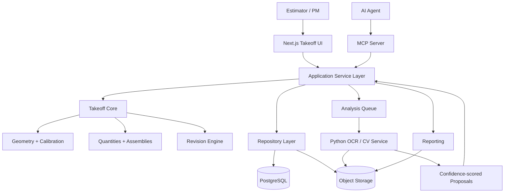

# Construction Takeoff Platform Rebuild Blueprint

## Goal

Turn the current PDF measurement prototype into a full construction takeoff platform without discarding working code. The rebuild must support professional manual takeoff first, then assisted/AI takeoff, persistence, revisions, quantity rollups, assemblies, estimating inputs, reports, and MCP access.

## Current State

Working today:
- Next.js + PDF.js multi-page blueprint viewer.
- Manual straight-line and polygon-area takeoff.
- Two-point scale calibration.
- Page-specific browser measurements.
- TypeScript MCP server with PDF text extraction, blueprint checks, dimension extraction, keyword counts, distance/area math, takeoff JSON save/load, and CSV/text reporting.
- Vitest coverage for MCP geometry/tools.
- CI builds web and MCP packages.

Architecture gaps:
- Geometry is duplicated in the browser hook, TypeScript MCP server, and Python.
- Python OCR/geometry is not connected to the deployed app or CI.
- The web API directly imports the MCP tool handler rather than sharing a domain/application service.
- PDFs are posted as base64 JSON and copied to temp files.
- Persistence is arbitrary filesystem JSON, not project-scoped storage.
- Measurements are stored in rendered canvas pixels instead of stable PDF/sheet coordinates.
- Calibration is effectively one mutable browser value, not a sheet/detail calibration record.
- No project/drawing-set/revision/cost-code/assembly/estimate domain model exists yet.
- Some current “AI” tool names overstate what the implementation actually does.

## Target Structure

```text
Mudd-monkies/
├─ apps/
│  └─ web/                       # Next.js takeoff UI
├─ packages/
│  ├─ takeoff-core/              # canonical geometry + quantity domain
│  ├─ schemas/                   # shared validation/types
│  ├─ pdf-engine/                # coordinates, rendering, page metadata
│  ├─ mcp-server/                # MCP adapter over application services
│  ├─ reporting/                 # CSV/XLSX/PDF exports
│  └─ test-fixtures/             # known-answer blueprint fixtures
├─ services/
│  └─ vision/                    # Python OCR/CV service
├─ docs/
│  ├─ architecture/
│  └─ plans/
└─ infra/
   ├─ docker/
   └─ k8s/
```

This is the destination, not an immediate directory shuffle. The migration should be incremental.

## Canonical Domain

### Project
- id, name, customer, estimator, status, timestamps

### DrawingSet
- id, projectId, issuedDate, revision, sourceFile, fileHash

### Sheet
- id, drawingSetId, sheetNumber, title, discipline, pageIndex, dimensions, rotation

### Calibration
- id, sheetId, optional viewport/detail region, two source points, known distance, unit, transform, provenance, confidence

### Annotation
- id, sheetId, revisionId, type, normalized/PDF geometry, layer, style, creator, timestamps

### TakeoffItem
- id, annotationId, costCode, description, quantityType, quantity, unit, wasteFactor, adjustedQuantity, optional assembly, source, confidence, reviewStatus

### Assembly
Maps measured quantities to construction components. Example:

```text
Exterior wall SF
 -> sheathing SF
 -> WRB SF
 -> lath SF
 -> plaster SF
 -> corner bead LF
 -> fasteners EA
```

### Revision / ChangeSet
- old/new sheet linkage
- alignment transform
- changed regions
- affected annotations
- carry-forward/re-measure decisions
- audit history

### Estimate
- quantities
- labor/material/equipment/subcontract
- unit costs
- tax/markup
- alternates
- exclusions

## One Measurement Engine

Create one authoritative implementation under `packages/takeoff-core`.

It owns:
- Euclidean distance
- polyline length
- polygon/rectangle/circle area
- arc length
- volume from area × depth
- coordinate transforms
- scale/calibration
- unit conversion
- snap-to-point/line/intersection
- orthogonal lock
- polygon closure/validation

The UI, MCP layer, reports, and tests all call this same engine.

Python vision may propose geometry, but does not become a second authoritative measurement engine.

## Coordinate Model

Store takeoff geometry in PDF/sheet coordinates, not canvas pixels.

```text
pointer
 -> canvas coordinate
 -> inverse PDF viewport transform
 -> stable PDF/sheet coordinate
 -> canonical annotation geometry
```

Rendering performs the reverse transform. Zoom, DPI, and browser size must not alter saved quantities.

## PDF Ingestion

1. Multipart/streaming upload.
2. Store original PDF in object storage.
3. Compute SHA-256 for revision identity.
4. Extract PDF metadata/page count.
5. Create stable sheet records.
6. Render preview tiles/thumbnails.
7. Extract vector text when present.
8. OCR only scanned/raster regions or missing text.
9. Parse/propose title block, sheet number, title, scale, revision.
10. User confirms uncertain metadata.

## Vision / OCR Service

Python is retained as a dedicated service only if it passes the tool qualification gate.

Responsibilities:
- OCR
- title block recognition
- dimension text detection
- line/region detection
- symbol candidate detection
- sheet alignment
- revision/change detection

It returns proposals with:
- geometry
- normalized value
- confidence
- model/version
- evidence/source region

It does not silently create final quantities.

## MCP Design

MCP becomes another adapter over the same application services used by the web UI.

Read tools:
- list_projects
- get_project
- list_sheets
- get_sheet_metadata
- get_annotations
- get_takeoff_summary
- get_estimate_summary
- search_blueprint_text

Analysis tools:
- analyze_sheet
- extract_dimensions
- detect_symbol_candidates
- validate_scale
- compare_revisions
- calculate_quantity

Write tools:
- add_annotation
- update_annotation
- delete_annotation
- create_takeoff_item
- create_assembly
- apply_assembly
- mark_review_status
- generate_report

Writes operate on project/sheet IDs and validated domain schemas, never arbitrary server file paths.

## Application Boundary

```text
Web UI -----------┐
                  v
             Application Services
                  |
MCP Adapter ------┘
                  |
       Takeoff Core / Repositories
           |               |
       PostgreSQL        Object Storage
           |
       Vision Job Queue
           |
       Python Vision Service
```

The current direct web import of `callToolHandler` is replaced by shared application services.

## Revision Intelligence

1. Match revised sheets.
2. Align old/new sheet geometry.
3. Detect changed regions.
4. Overlay change map.
5. Mark takeoff items affected.
6. Let estimator carry forward, replace, remeasure, or ignore.
7. Preserve decisions and prior quantities.

## Manual Takeoff Tool Set

- select/pan
- calibration
- line
- continuous/polyline
- polygon
- rectangle
- circle
- count
- volume/depth
- add/subtract area
- openings
- duplicate/delete
- undo/redo
- layers
- keyboard shortcuts
- snapping
- orthogonal lock
- measurement labels

## Assisted Takeoff

AI results are proposals:
- walls
- rooms/regions
- doors/windows/fixtures
- dimensions
- scale
- title-block metadata

Each proposal has Accept / Reject / Edit plus confidence and provenance.

## Storage

PostgreSQL:
- projects
- drawing_sets
- sheets
- sheet_revisions
- calibrations
- layers
- annotations
- takeoff_items
- assemblies
- assembly_items
- estimates
- estimate_items
- audit_events
- analysis_jobs
- analysis_results

S3-compatible object storage:
- original PDFs
- rendered tiles
- thumbnails
- OCR/CV derivatives
- reports
- revision overlays

## Mermaid Architecture



## Migration Rule

Use a strangler migration. Do not rewrite the viewer first.

Build the canonical core underneath the existing UI, migrate measurement math, coordinates and persistence into it, then replace UI and AI pieces incrementally.
