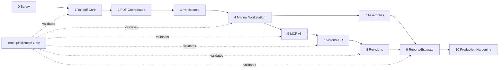

# Full Takeoff Platform Rebuild Plan

**Goal:** Build the production takeoff platform around one trustworthy measurement/domain core, then attach the web UI, MCP, OCR/CV, persistence, estimating and reporting to that same core.

**Architecture spec:** `docs/architecture/TAKEOFF_PLATFORM_REBUILD_BLUEPRINT.md`  
**Tool gate:** `docs/architecture/TOOL_QUALIFICATION_AUDIT.md`

## Phase 0 - Safety and truth

- [ ] Add runtime request schemas for current tool inputs.
- [ ] Prevent web clients from passing arbitrary server file paths.
- [ ] Replace client-controlled temp filenames with generated safe storage.
- [ ] Split local stdio MCP filesystem behavior from production web behavior.
- [ ] Rename or quarantine tools whose names overstate functionality.
- [ ] Remove/extract Android MCP from the takeoff product boundary.

## Phase 1 - Canonical takeoff core

Create:
```text
packages/takeoff-core/
  src/
    geometry/
    calibration/
    coordinates/
    units/
    quantities/
    assemblies/
    revisions/
```

- [ ] Port TypeScript area/distance functions into core.
- [ ] Move browser calculations to core.
- [ ] Decide which Python spatial algorithms are worth porting/reusing.
- [ ] Add polyline, rectangle, circle, arc, volume, add/subtract, snapping.
- [ ] Add normalized PDF-coordinate transforms.
- [ ] Add typed units and conversions.
- [ ] Build property/golden tests.

**Gate:** one authoritative calculation engine.

## Phase 2 - Stable PDF coordinate model

- [ ] Save annotations in PDF/sheet coordinates.
- [ ] Convert pointer -> viewport -> PDF coordinates.
- [ ] Render PDF coordinates back through current viewport.
- [ ] Verify quantities remain unchanged at multiple zoom levels/DPI.
- [ ] Support page rotation.

**Gate:** zoom/render changes cannot change saved takeoff.

## Phase 3 - Project persistence

Introduce PostgreSQL and S3-compatible object storage.

- [ ] Project/drawing-set/sheet schemas.
- [ ] Calibration/layer/annotation/takeoff schemas.
- [ ] Upload original PDF once; store SHA-256.
- [ ] Multipart/streaming uploads.
- [ ] Project-scoped repository services.
- [ ] Audit events.

**Gate:** no production persistence uses arbitrary filesystem paths.

## Phase 4 - Manual takeoff workstation

- [ ] Pan/select.
- [ ] line/polyline.
- [ ] polygon/rectangle/circle.
- [ ] count.
- [ ] volume/depth.
- [ ] add/subtract openings.
- [ ] undo/redo.
- [ ] snapping and orthogonal lock.
- [ ] layers/styles.
- [ ] keyboard shortcuts.
- [ ] per-sheet/detail calibration manager.
- [ ] takeoff item editor and cost-code assignment.

**Gate:** professional manual takeoff works without AI.

## Phase 5 - MCP v3 over application services

- [ ] Define shared schemas.
- [ ] Web and MCP call the same application services.
- [ ] Read tools first.
- [ ] Analysis tools second.
- [ ] Project-scoped write tools third.
- [ ] Remove arbitrary path APIs.
- [ ] Structured JSON tool responses, not prose-only payloads.
- [ ] Tool qualification record for every MCP tool.

**Gate:** MCP cannot bypass project/security/domain rules.

## Phase 6 - Vision/OCR service

Create explicit Python service.

- [ ] Reproducible Python dependency file/container.
- [ ] OCR endpoint.
- [ ] dimension parser.
- [ ] title-block parser.
- [ ] scale proposal.
- [ ] line/region detector.
- [ ] symbol candidate detection.
- [ ] real confidence/provenance.
- [ ] job queue and timeout/retry model.
- [ ] real labeled fixture benchmark.

**Gate:** all AI outputs are confidence-scored proposals; no fake confidence.

## Phase 7 - Assemblies and quantity rollups

- [ ] Cost codes.
- [ ] assemblies.
- [ ] waste factors.
- [ ] formulas.
- [ ] material/labor/equipment components.
- [ ] sheet/project rollups.
- [ ] unit-safe aggregation.

## Phase 8 - Revision comparison

- [ ] Match revised sheets.
- [ ] image/vector alignment.
- [ ] change-region detection.
- [ ] affected-takeoff identification.
- [ ] carry-forward/re-measure workflow.
- [ ] revision audit history.

## Phase 9 - Reporting / estimating handoff

- [ ] CSV.
- [ ] XLSX.
- [ ] printable PDF.
- [ ] JSON project export.
- [ ] rollups by sheet, cost code, layer, assembly, revision.
- [ ] never combine incompatible units.

## Phase 10 - Multi-user production hardening

- [ ] authentication.
- [ ] organizations/workspaces.
- [ ] project roles.
- [ ] signed file URLs.
- [ ] project authorization.
- [ ] rate/size limits.
- [ ] observability.
- [ ] backup/restore.
- [ ] deployment smoke tests.

## Tool Qualification Workstream

Runs across every phase:

- [ ] Build real plan-set fixture corpus.
- [ ] Add Tool Qualification Record schema.
- [ ] Grade existing tools Q1/Q2/Q3.
- [ ] Require golden tests for deterministic Q1 tools.
- [ ] Require benchmark metrics for probabilistic Q2 tools.
- [ ] Keep unqualified tools out of production menus/tool discovery.
- [ ] Re-qualify tools after major algorithm/model changes.

## Mermaid Delivery Flow



## Kanban

| Backlog | Ready | In Progress | Blocked | Done |
|---|---|---|---|---|
| Persistence/domain DB | Web/API filesystem safety fixes | Correct architecture + tool audit | Real OCR benchmark needs labeled blueprint corpus | Repo identity confirmed as PDF Takeoff Tool |
| Full manual tool palette | Canonical takeoff-core package |  | Visual symbol detector requires model/data selection | Existing MCP tool inventory |
| MCP v3 | PDF coordinate normalization |  | Multi-user auth depends on persistence choice | Current geometry test review |
| Vision/OCR service | Dimension parser rewrite |  | Revision CV depends on stable sheet coordinates | Current viewer audit |
| Assemblies/cost codes | Report unit-safety fix |  |  | Current Python OCR audit |
| Revision comparison | Rename/quarantine misleading tools |  |  | Security boundary issue identified |
| XLSX/PDF reporting | Remove/extract Android MCP |  |  |  |
| Auth/workspaces |  |  |  |  |

## Suggested PR Sequence

1. **PR A: safety + tool truth**
   - path security
   - runtime schemas
   - tool rename/quarantine
   - unit-safe report fix

2. **PR B: takeoff-core**
   - canonical geometry/units/calibration tests

3. **PR C: PDF coordinates**
   - transform annotations away from raw canvas pixels

4. **PR D: persistence**
   - project/drawing/sheet/annotation storage and object uploads

5. **PR E: manual workstation**
   - expanded professional tool set

6. **PR F: MCP v3**
   - project-aware structured tools over application services

7. **PR G: vision/OCR**
   - service + benchmark harness

8. **PR H: assemblies/revisions/reporting**
   - quantity intelligence and export

9. **PR I: multi-user production**
   - auth, RBAC, observability, deployment hardening

## Definition of Done

- [ ] One authoritative geometry/calibration engine.
- [ ] Saved quantities are independent of zoom/render scale.
- [ ] Every production tool has a qualification record.
- [ ] Misleading keyword/heuristic tools are renamed or replaced.
- [ ] OCR/CV has measured benchmark accuracy, not mocked confidence.
- [ ] No arbitrary filesystem paths from web or project-scoped MCP writes.
- [ ] Professional manual takeoff works without AI.
- [ ] AI augments rather than silently invents final quantities.
- [ ] Revisions preserve and audit takeoff changes.
- [ ] Reports are unit-safe.
- [ ] MCP and web share the same domain/application services.
